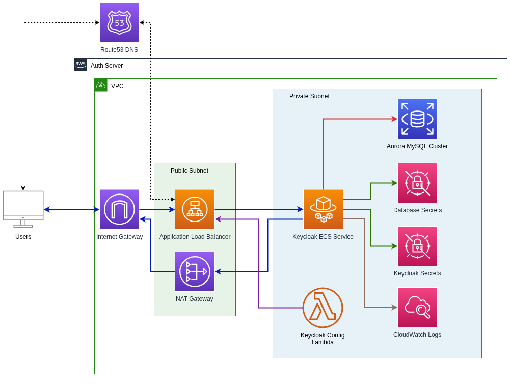

# Architecture Documentation

This directory contains architectural documentation and design diagrams for the AMS Authentication Server.

## Architecture Overview

The AMS Auth Server provides centralized authentication and identity management. It's built using AWS services for high availability, scalability, and security.

## Architecture Diagrams

**Available Formats:**
- **PNG Image**: `keycloak-architecture.png` - For viewing and documentation
- **XML Format**: `keycloak-architecture.xml` - For importing into draw.io

The XML file is fully compatible with draw.io, allowing you to edit, customize, and export the architecture diagram in various formats.

### Key Components

#### Network & Load Balancing
- **VPC**: Isolated network environment with public and private subnets
- **Application Load Balancer (ALB)**: Routes external traffic to Keycloak containers
- **Route53**: DNS resolution for the authentication service
- **Internet Gateway & NAT Gateway**: Secure internet connectivity

#### Compute Platform
- **ECS Fargate Cluster**: Serverless container platform hosting Keycloak
- **Keycloak Containers**: Multiple instances for high availability (2+ containers)
- **Auto Scaling**: Automatic scaling based on CPU utilization (default: 75% target)

#### Database
- **Aurora MySQL Cluster**: Managed database service for Keycloak data
- **Writer Instance**: Primary database instance for writes
- **Reader Instance**: Read replica for improved performance

#### Security & Configuration
- **Secrets Manager**: Secure storage for database credentials and Keycloak admin secrets
- **Lambda Function**: Post-deployment configuration of Keycloak realms, clients, and users
- **Security Groups**: Network-level security controls

#### Monitoring & Logging
- **CloudWatch Logs**: Centralized logging for containers and Lambda functions

### Data Flow

1. **User Authentication Request**
   - When a custom domain is configured, users access through Route53 DNS. Otherwise, users connect directly via the load balancer DNS name.
   - Traffic flows through the Application Load Balancer
   - Load balancer distributes requests across Keycloak containers

2. **Database Operations**
   - Keycloak containers connect to Aurora MySQL for data persistence
   - Write operations go to the writer instance
   - Reader instance provides high-availability failover and can be promoted to writer if the primary fails
   - Database replication ensures data consistency

3. **Secrets Management**
   - Containers retrieve database credentials from Secrets Manager
   - Admin credentials are securely stored and accessed as needed

4. **Configuration**
   - Lambda function configures Keycloak after deployment
   - Custom realms, clients and users are set up automatically

### Deployment Modes

The architecture supports flexible deployment configurations:

#### Internet-Facing Deployment
- Public-facing Application Load Balancer with HTTPS
- Route53 DNS records for custom domain access
- SSL/TLS termination at the load balancer
- Suitable for production environments requiring external access

#### Internal-Only Deployment
- Internal Application Load Balancer for VPC-only access
- HTTP listeners with optional HTTPS upgrade
- No external DNS requirements
- Suitable for development or internal-only environments

### High Availability Features

- **Multi-AZ Deployment**: Resources distributed across multiple Availability Zones
- **Auto Scaling**: Automatic container scaling based on demand
- **Database Clustering**: Aurora MySQL with writer/reader instances
- **Load Balancing**: Traffic distributed across healthy containers
- **Health Checks**: Automated health monitoring and failover

### Security Features

- **Network Isolation**: Private subnets for containers and database
- **Security Groups**: Granular network access controls
- **Secrets Management**: Encrypted storage of credentials
- **SSL/TLS Encryption**: HTTPS for external communication
- **Database Encryption**: Encrypted storage at rest

### Monitoring & Observability

- **Container Insights**: Detailed ECS metrics and monitoring
- **CloudWatch Logs**: Centralized log aggregation
- **Health Checks**: Load balancer and service health monitoring
- **Auto Scaling Metrics**: Performance-based scaling triggers

## Configuration and Deployment

For detailed configuration options, deployment procedures, and technical implementation details, see the **[CDK Technical Guide](../cdk/README.md)**.

The architecture is deployed using AWS CDK with TypeScript, providing infrastructure-as-code capabilities and comprehensive configuration management.
